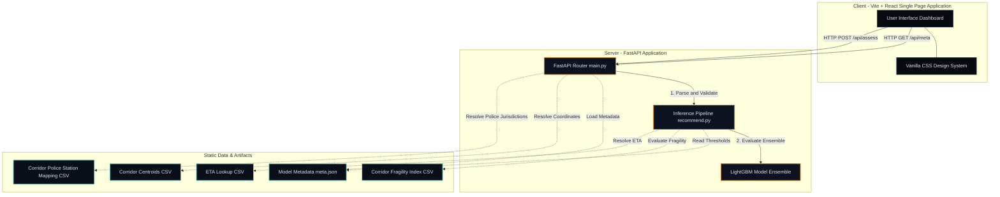

# GridLock 2.0 - Corridor Watch

Corridor Watch is a production-quality, professional decision-support and traffic command dashboard designed for the Bengaluru Traffic Command. The system automates incident triage by assessing the probability of road closure, estimating median clearance times, evaluating corridor vulnerability metrics, and suggesting optimal diversion strategies for traffic controllers.

---

## 1. System Architecture

The application is structured as a decoupled client-server architecture. The backend service encapsulates the core machine learning inference pipeline and serves pre-computed topological data, while the frontend single-page application displays the real-time operational status.



### Components

#### Frontend Single-Page Application (SPA)
The frontend is a lightweight Single-Page Application built with React, TypeScript, and Vite. All styles are declared in vanilla CSS, implementing a dark operations-center theme utilizing amber as the primary command color.
- **Incident Intake Panel (Left Column)**: Collects operational incident parameters, including incident category, targeted traffic corridor, police jurisdiction overrides, incident scheduling, classification, and report authentication tags.
- **Risk Assessment Panel (Center Column)**: Renders a custom SVG semicircular gauge visualizing closure probability, paired with contextual information tags and structural fragility scores.
- **Operational Intelligence Panel (Right Column)**: Displays action items, recommended diversion routes, and an auto-generated summary report.

#### Backend REST API (FastAPI)
The backend is a python-based REST API built with FastAPI. It handles routing, requests verification, coordinates resolution, and delegates tasks to the machine learning inference pipeline.
- **`GET /health`**: Health check endpoint.
- **`GET /api/meta`**: Reads training metadata to generate validated dropdown parameters for the frontend client.
- **`POST /api/assess`**: Receives incident payloads, normalizes inputs, resolves implicit details, evaluates the prediction ensemble, and formats the response.

#### Inference & Analytics Engine
Residing in the backend under the `theme2` module, this component loads pre-trained model ensembles and static lookup files. It performs multi-class category encoding, calculates road closure risk, retrieves median clearance estimates, and dynamically identifies lower-vulnerability corridors in the target traffic zone.

---

## 2. Operational Data Flow

The following flowchart outlines the step-by-step execution lifecycle when an operator logs a new incident:


---

## 3. Technical Stack

- **Frontend**:
  - Framework: React 18 with TypeScript
  - Bundler: Vite 8
  - Styling: Vanilla CSS (Theme: Amber on Jet Black, font families: Inter and JetBrains Mono)
  - Layout: CSS Grid (3-column dashboard topology)

- **Backend**:
  - Runtime: Python 3.11
  - Framework: FastAPI
  - Web Server: Uvicorn
  - Data Processing: Pandas, NumPy
  - Serialization: Joblib
  - Model Framework: LightGBM

---

## 4. Local Development Setup

### Directory Structure

```
/backend
  /theme2                   # Self-contained ML code and artifacts
    /artifacts              # Serialized LightGBM models, mapping and lookup tables
    recommend.py            # Primary recommendation and inference script
    train.py                # Model training routine
  main.py                   # FastAPI application entrypoint
  requirements.txt          # Python dependencies
  render.yaml               # Backend deployment blueprint configuration
/frontend
  /public                   # Public assets (custom street light SVG favicon)
  /src
    /components             # Modular React components (Gauge, metrics display)
    App.tsx                 # Core page layout, form handling, and state management
    index.css               # Design system and CSS variables
    main.tsx                # Client application root mount
  package.json              # Node dependencies and scripts
  tsconfig.json             # TypeScript compiler rules
```

### Prerequisites
- Node.js (version 18 or newer)
- Python (version 3.11)

### Backend Service Setup
1. Navigate to the backend directory:
   ```bash
   cd backend
   ```
2. Create and activate a virtual environment:
   ```bash
   python -m venv venv
   # On Windows (Command Prompt)
   venv\Scripts\activate
   # On Windows (PowerShell)
   .\venv\Scripts\Activate.ps1
   # On Linux/macOS
   source venv/bin/activate
   ```
3. Install the required dependencies:
   ```bash
   pip install -r requirements.txt
   ```
4. Run the Uvicorn local development server:
   ```bash
   uvicorn main:app --reload --port 8000
   ```
   The API documentation will be available locally at `http://localhost:8000/docs`.

### Frontend Client Setup
1. Open a new terminal window and navigate to the frontend directory:
   ```bash
   cd frontend
   ```
2. Install the required Node packages:
   ```bash
   npm install
   ```
3. Launch the Vite local development server:
   ```bash
   npm run dev
   ```
   The client application will run at `http://localhost:5173/`.

---

## 5. Production Deployment

### Backend Deployment (Render)
1. Commit and push the project changes to a GitHub repository.
2. Log into the Render Dashboard and choose **New > Web Service**.
3. Connect the repository.
4. Set the following environment configuration parameters:
   - **Root Directory**: `backend`
   - **Runtime**: `Python`
   - **Build Command**: `pip install -r requirements.txt`
   - **Start Command**: `uvicorn main:app --host 0.0.0.0 --port $PORT`
5. Under Advanced settings, declare the environment variable:
   - `PYTHON_VERSION`: `3.11.4`

### Frontend Deployment (Vercel)
1. In Vercel, select **New Project** and import the target repository.
2. Select **Vite** as the framework preset.
3. Set the **Root Directory** to `frontend`.
4. Add the following environment variable in the dashboard configurations:
   - `VITE_API_URL`: Set this value to the live HTTPS URL of the deployed Render backend (e.g., `https://gridlock-api.onrender.com`).
5. Click **Deploy**.

---

## 6. Credits

### Hackathon Team Members
- Anurag Kumar Verma
- Shreyanshu Ghosh
- Abhishek Kumar

